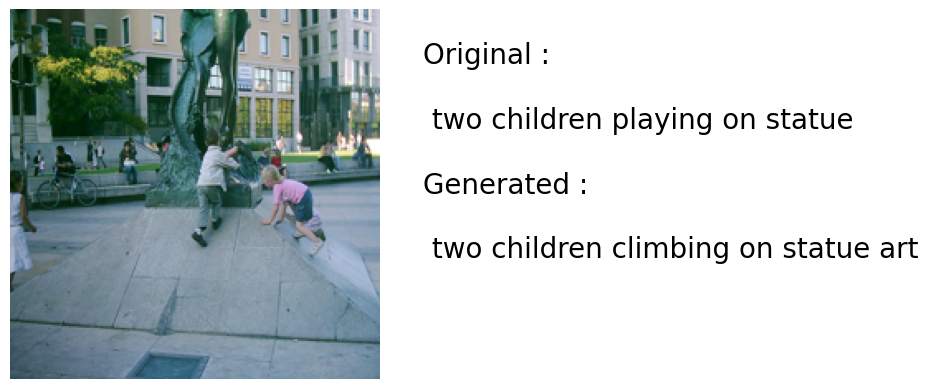
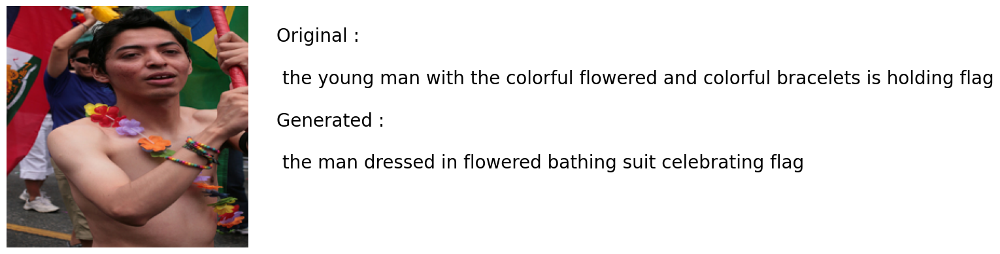

# Image Captioning With Visual Attention

This project is a trial implementation for the paper "Show, Attend and Tell: Neural Image Caption Generation with Visual Attention" while using the Bahdanau Attention mechanism .

## Project Details:

The aim of the project is to do image captioning where it descripes the image , the model can be integrated with camera for various real world applications . ex : (Medical apps for Blind People , where the model would describe what camera detects thus converting text into speech using external api , notice that i didn't implement the speech part) .

The AI model consists of 3 parts :

    1. Encoder : Using Inception V3 model as the feature Extractor.

    2. Attention : Custom Attention Bahdanau Class , Uses Dense layer and activation functions, where it combines the hidden states of the decoder with the image features at each time step.

    3. Decoder : Embedding and GRU layer , where it takes the combined features to know what word attends to which pixels in the image.

The training part was done manually , as it is more flexible according to how complex the task is , Also a temperature mechanism was applied to resample the outputs where this does allow for more creativity (randomality)

## Results :

---

# Feature steps :

This initial version can be more organized than this allowing for deployment using any GUI and containerizing using Docker
